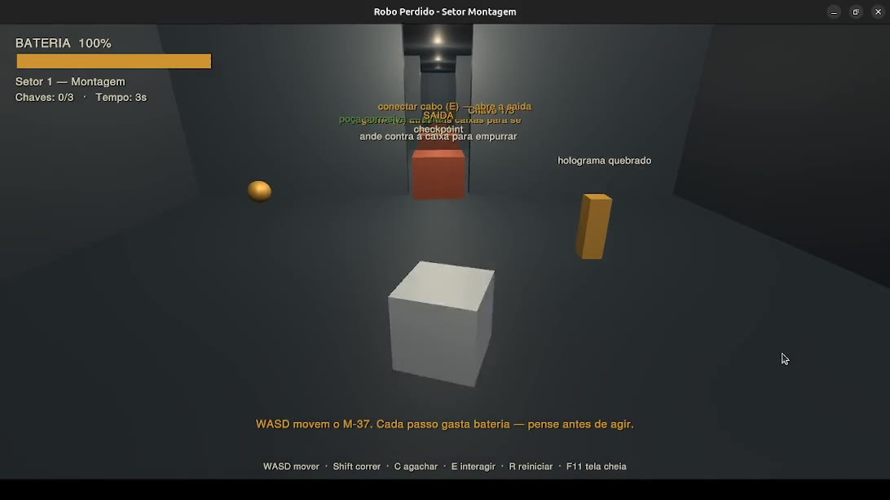
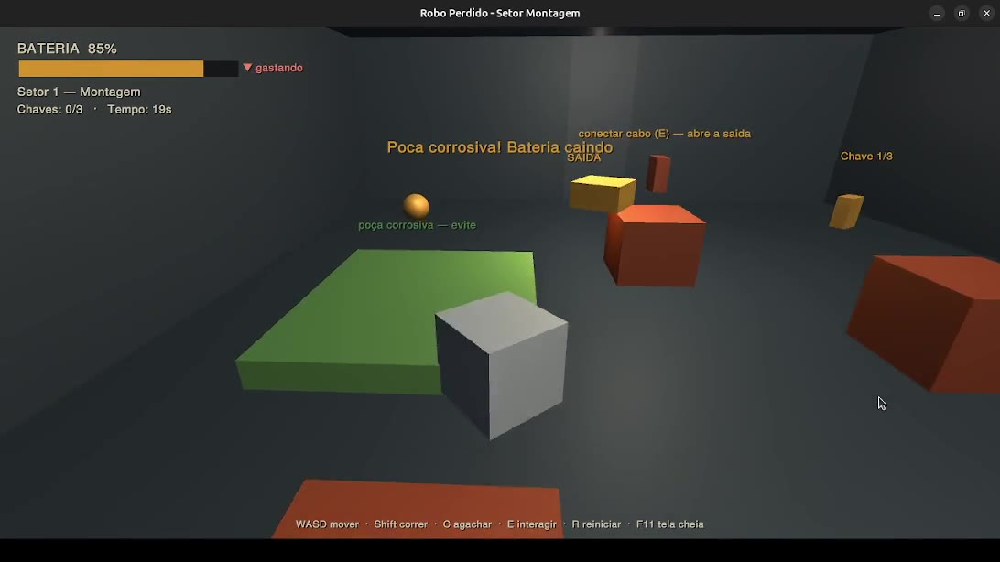
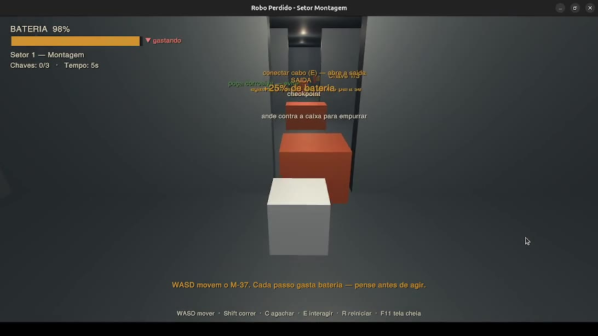
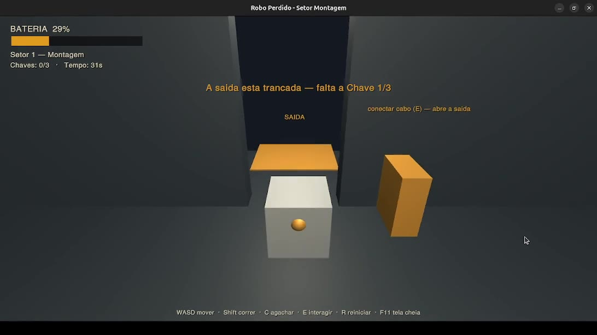
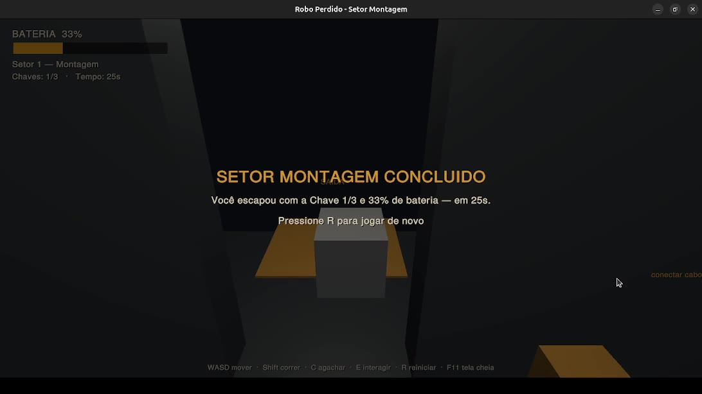

# Robô Perdido - Mini-relatório da Etapa 7: Vertical Slice

**Equipe:** Emily Frade dos Santos (23.1.8001) · Luís Eduardo Bastos Rocha (23.1.8095)

**Vídeo:** <https://youtu.be/_a3xo_OouDw>

**Repositório:** https://github.com/EmilyFrade/robo-perdido

---

## 1. Decisões técnicas

### Engine e linguagem
- **Unity 6 (6000.4.11f1)**, scripts em **C#**. Escolha definitiva tomada no início da etapa
  (Passo 1), antes de qualquer mecânica, para travar o risco de "engine errada".
- **Built-in Render Pipeline** (sem URP/HDRP). Decisão deliberada: permite usar
  `Shader.Find("Standard")` e materiais com emissão simples sem precisar configurar um
  *pipeline asset*. É suficiente para placeholders; a migração para URP, se desejada, fica
  para a fase de arte.
- **Sem bibliotecas/pacotes externos.** A HUD inteira é desenhada via **IMGUI (`OnGUI`)**,
  evitando dependência de Canvas/TextMeshPro nesta fase. O `manifest.json` permanece enxuto.

### Arquitetura básica
A decisão arquitetural mais relevante do projeto: **a fase inteira é montada em tempo de
execução por código** (`Bootstrap.cs`), usando primitivas (`GameObject.CreatePrimitive`).
A cena salva (`SectorMontagem.unity`) contém **um único objeto** (`GameBootstrap`).

**Por quê:** cenas `.unity` são arquivos enormes e cheios de GUIDs; em trabalho de dupla
geram conflitos de merge horríveis, e assets binários incham o histórico do Git.

**Resultado:** o repositório versiona praticamente só texto (scripts), o *diff* é legível,
e qualquer integrante clona, abre a cena e dá *Play* sem configurar nada na hierarquia.

**Custo aceito:** não dá para "arrastar e posicionar" no editor — o level design vive em
código. Para um vertical slice de uma fase, valeu a pena.

Componentes principais (separação de responsabilidades):

| Script | Responsabilidade |
| --- | --- |
| `Bootstrap.cs` | Constrói todo o cenário, player, câmera, luzes e puzzles em runtime |
| `RobotController.cs` | Coração do core loop: input, movimento e **custo de bateria por ação** |
| `BatterySystem.cs` | Estado da "vida-bateria" (drenar/recarregar); só guarda dados |
| `GameManager.cs` | Estado global (chaves, vitória/derrota, tempo) + HUD via IMGUI |
| `PatrolDrone.cs` | Antagonista: patrulha por waypoints, detecção por visão e audição |
| `PushBox.cs` / `InteractPanel.cs` | Puzzle 1 (empurrar) e Puzzle 2 (conectar cabo) |
| `CorrosivePuddle.cs` / `EnergyCell.cs` / `IndustrialKey.cs` / `ExitZone.cs` | Perigos, recarga, coleta e saída |
| `CameraFollow.cs` | Câmera em 3ª pessoa com *raycast* anticolisão |

---

## 2. O que foi implementado (core loop)

A mecânica central de *Robô Perdido* é **"bateria = vida"**: cada ação consome energia em
ordem crescente de custo, então cada passo é uma decisão. O setor implementado é o
**Setor 1 — Montagem**, jogável de ponta a ponta.

**Custos de bateria (por segundo, conforme tabela da Etapa 6):**
parado `0,05` < agachar `0,7` < andar `1,2` < correr `3,0` < empurrar `3,2` (1,2 + 2,0).
Conectar painel custa `3,0` (gasto único). Drone ao detectar: `−40`. Poça corrosiva: `−14/s`.

Mecânicas no protótipo:
- **Mover / correr / agachar** com trade-off real: correr é rápido mas faz **barulho**;
  agachar é lento mas **silencioso**.
- **Empurrar caixa** física (Puzzle 1) para destravar a passagem no portão.
- **Interagir / conectar cabo** no painel (Puzzle 2, tecla `E`) para abrir a saída.
- **Coletar células de energia** (recarga — alívio do loop).
- **Drone de patrulha** com rota fixa e detecção por **visão (cone + linha de visada,
  bloqueada por coberturas)** e **audição** (correr por perto denuncia).
- **Poça corrosiva** que drena bateria (ensino visual de perigo de área).
- **HUD** com bateria, contador de chaves, setor e tempo; **vitória/derrota** e reinício (`R`).

**Objetivo da demo:** atravessar economizando bateria — empurrar a caixa, passar pela sala
do drone usando coberturas, pegar a **Chave 1/3**, conectar o cabo no painel e chegar à
**Saída**. Bateria a **0% = derrota**. O loop roda continuamente bem além dos 30–60 s
exigidos, sem travar.

### Screenshots

---

## 3. Relatório do playtest

**Protocolo:** sessões de 10–20 min, sem explicação prévia, observador em silêncio.

### Observações (o que travou)
- **Onboarding de "bateria = vida":** dois testadores não associaram a barra
  âmbar à própria sobrevivência nos primeiros segundos. 
- **Corrida acidental:** jogadores acostumados a segurar `Shift` correram sem
  querer perto do drone e foram detectados. 
- **Poça corrosiva = morte quase instantânea:** `−14/s` zera a bateria rápido
  demais; ninguém percebeu o dano a tempo de sair. 
- **Furtividade pouco legível:** sem cone de visão desenhado, o primeiro não percebeu que
  as coberturas bloqueavam a visão do drone.
- **Sobreposição de letreiros:** no corredor inicial, vários rótulos de mundo se
  empilham e ficam ilegíveis (visível nos screenshots do início).

### O que funcionou (validações positivas)
- **O verbo central é claro e tem tensão.** Todos os três, depois de entender, passaram a
  **pesar cada movimento**, exatamente a emoção-alvo do design.
- **Empurrar a caixa** foi descoberto sem ajuda por todos (o letreiro "ande contra a caixa"
  ajudou).
- **A vitória recompensa eficiência:** a mensagem mostrando "% de bateria restante"
  incentivou um jogador a querer rejogar para "terminar com mais bateria".

### Perguntas do pós-teste (resumo)
- *O que entendeu?* → "economizar energia até a saída" (consenso). "Bateria = vida"
  só ficou claro para todos após uma morte.
- *O que esperava acontecer?* → alguns esperavam um botão dedicado de correr (não reflexo
  de `Shift`); um deles esperava que a barra fosse tempo.
- *O que mais quis fazer?* → recarregar de propósito gerenciando risco, e ver o cone
  de visão do drone para planejar a esgueirada.

---

## 4. Problemas identificados e ajustes planejados (próxima etapa)

Priorizados por impacto no core loop (do playtest + diário técnico):

| Prioridade | Problema | Ajuste planejado |
| --- | --- | --- |
| Alta | "Bateria = vida" não comunicada | Rótulo explícito na HUD ("BATERIA = VIDA") e tela de morte que nomeia a causa |
| Alta | Poça corrosiva mata instantâneo | Reduzir dreno para um valor que **avise antes**; checar colisores duplicados |
| Alta | Corrida acidental com `Shift` | Reavaliar "segurar para correr" + feedback visual claro do estado correndo |
| Média | Furtividade ilegível | Desenhar um **cone de visão** visível do drone |
| Média | Sobreposição de letreiros | Resolver empilhamento dos rótulos projetados (offset/declutter) |

---

## 5. Checklist da Etapa 7

- [x] Engine escolhida e ambiente configurado para todos
- [x] Repositório Git com histórico
- [x] Core loop jogável (mesmo com placeholders)
- [x] Build empacotada e testável fora do editor
- [x] Pelo menos 3 sessões de playtest
- [x] Vídeo curto (1–2 min) do protótipo
- [x] Mini-relatório (este documento)
- [x] Diário técnico com problemas e soluções
